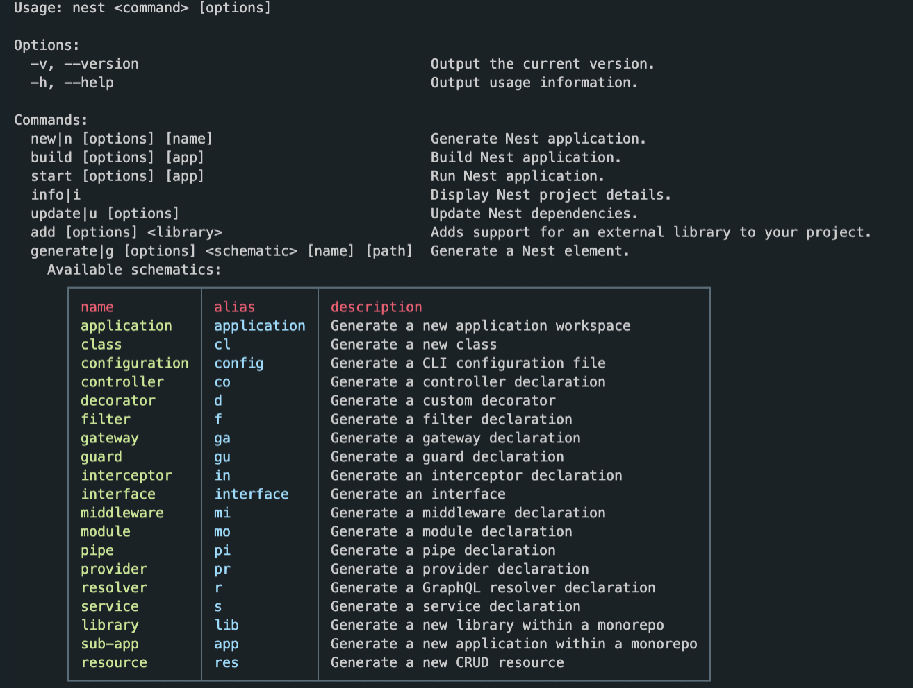

# 2.0 Movies Controller

NestJS는 Node.js의 프레임워크 -> 우리가 설치한 cli에 우리가 사용할 수 있는 것들이 있음

```
$ nest
```



```
$ nest generate controller
OR
$ nest g co
```

```ts
// movies.controller.ts

import { Controller, Get } from "@nestjs/common";

@Controller("movies")
export class MoviesController {
  @Get() // /movies
  getAll() {
    return "This will return all movies";
  }
  @Get("/:id") // /movies/:id
  getOne() {
    return "this will return a movie";
  }
}
```

여기서 url에 있는 id를 받아오고자 함 -> Decorator 활용!

express에서는 호출하는 함수에 자동으로 req, res가 있었음. ([유튜브클론 코드참고](https://github.com/bravacoreana/newtube/blob/0bde21c00f3fdf6ef87b59c585fa484b5e9d59ba/src/controllers/userController.js#L175)) 그리고 그 안에는 우리가 get, post, patch, delete 등 http request methods를 활용하기 위한 정보들이 담겨있었음. 반면에 nestJS에서는 내가 뭘 원하는지 데코레이터를 이용해 요청해야 함.

```ts
  @Get("/:id")
  getOne(@Param("id") id:string) {
    // getOne 함수를 호출할 때 파라미터(/movies/:id)에 있는 id 값을 저장해줘!
    return "this will return a movie";
  }
```

- 파라미터 데코레이터(`@Params('id')`) 를 사용해야 비로소 NestJS는 우리가 원하는 것이 url에 있는 id 파라미터라는 걸 앎
- `/:id` 와 `@Param("id")` 에서 `id` 부분은 반드시 똑같아야 함
- 반면에 `getOne(@Param("id") id:string)`에서 `id:string` 부분은 `movieId:string` 등 입맛대로 바꿔도 됨

### apply HTTP request methods in nestjs

```ts
@Controller("movies")
export class MoviesController {
  @Get()
  getAll() {
    return "This will return all movies";
  }
  @Get("/:id")
  getOne(@Param("id") id: string) {
    return `this will return a movie with the id: ${id}`;
  }
  @Post()
  create() {
    return "this will create a movie";
  }
  @Delete("/:id")
  delete(@Param("id") id: string) {
    return `this will delete a movie with the id: ${id}`;
  }
  // @Put() // update all resource
  @Patch("/:id") // update only one movie
  patch(@Param("id") id: string) {
    return `this will update a movie with the id: ${id}`;
  }
}
```

---

[previous](1.2.services.md) / [next](2.1.more-routes.md)
