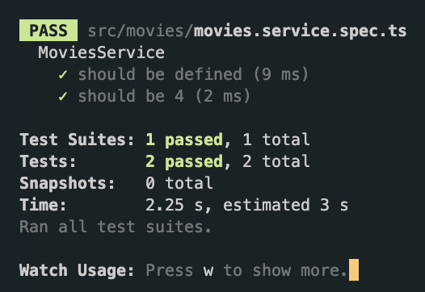
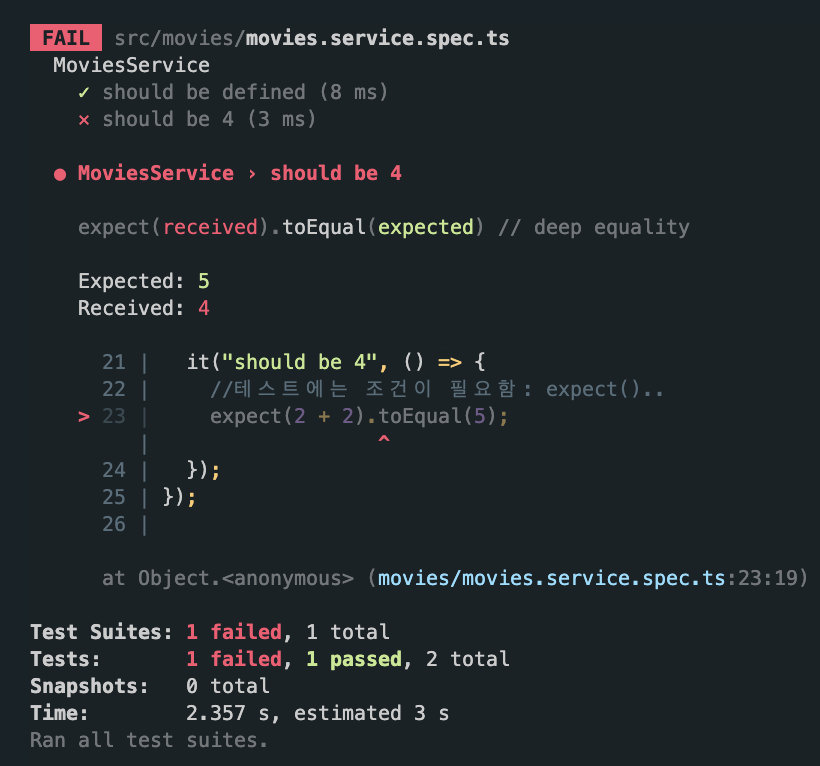

# 3.1 Your first Unit Test

jest: JS testing framework + Babel, TS, Node, React, Angular, Vue ...

```
$ npm run test:watch
```

```ts
// movies.service.spec.ts

import { Test, TestingModule } from "@nestjs/testing";
import { MoviesService } from "./movies.service";

describe("MoviesService", () => {
  let service: MoviesService;

  // execute sth before each test
  beforeEach(async () => {
    const module: TestingModule = await Test.createTestingModule({
      providers: [MoviesService],
    }).compile();

    service = module.get<MoviesService>(MoviesService);
  });

  // this is the test!
  it("should be defined", () => {
    expect(service).toBeDefined();
  });

  it("should be 4", () => {
    //테스트에는 조건이 필요함: expect()..
    expect(2 + 2).toEqual(5);
  });
});
```

```ts
it("should be 4", () => {
  //테스트에는 조건이 필요함: expect()..
  expect(2 + 2).toEqual(4);
});
```

expect 안에 있는 것이 프로퍼티 조건을 만족하게 하는 것이 우리의 타겟. 조건을 만족하면 PASS, 그렇지 않으면 에러!



