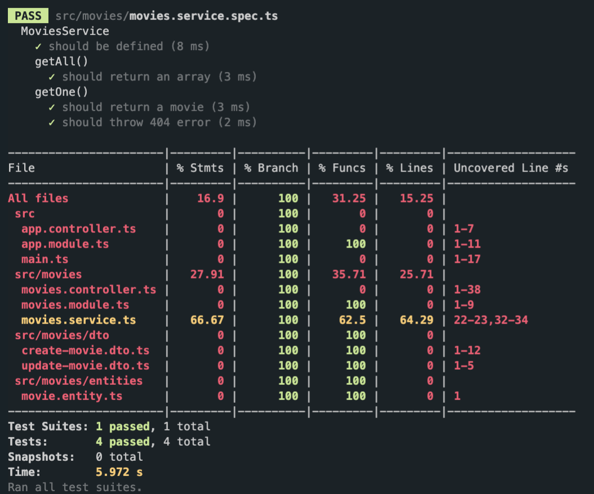

# 3.2 Testing getAll() and getOne()

```ts
describe("MoviesService", () => {
  //...
  describe("getAll()", () => {
    it("should return an array", () => {
      const result = service.getAll();
      expect(result).toBeInstanceOf(Array); // #1
    });
  });

  describe("getOne()", () => {
    it("should return a movie", () => {
      // #2
      service.create({
        title: "test movie",
        genres: ["test genre"],
        year: 2000,
      });
      const movie = service.getOne(1); // 우리는 이미 id가 1일 거라는 것을 알고 있음
      expect(movie).toBeDefined();
      expect(movie.id).toEqual(1);
    });
    // #3
    it("should throw 404 error", () => {
      try {
        service.getOne(999);
      } catch (error) {
        expect(error).toBeInstanceOf(NotFoundException);
        expect(error.message).toEqual("Movie(999) is not found");
      }
    });
  });
});
```

- #1 : `movies.service.ts`의 `getAll()`에서 `Movie[]`라는 배열을 리턴
- #2 : db에 저장되어 있는 movie 가 없으므로 `getOne()` 을 테스트 하기 전 영화 하나를 생성
- #3 : 에러를 발생시켰을 때 정상적으로 `NotFoundException` 이 작동하는지 확인

```ts
export class MoviesService {
  // database part
  private movies: Movie[] = [];

  getAll(): Movie[] {
    return this.movies; // 배열 반환
  }
  getOne(id: number): Movie {
    const movie = this.movies.find((movie) => movie.id === +id);
    if (!movie) {
      throw new NotFoundException(`Movie(${id}) is not found`); // 해당 영화 아이디가 없을 때 에러 발생
    }
    return movie;
  }
  //...
}
```

```
npm run test:cov
```

`movies.service.ts` 의 커버리지가 조금 더 올라간 것을 확인할 수 있음.



[previous](3.1.your-first-unit-test.md) / [next](3.3.testing-delete-and-create.md)
