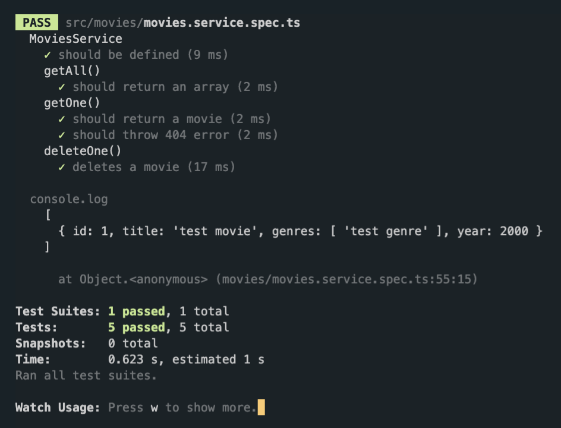

# 3.3 Testing Delete and Create

```ts
// 콘솔에 영화 생성되는 것 확인해보기

describe("deleteOne()", () => {
  it("deletes a movie", () => {
    service.create({
      title: "test movie",
      genres: ["test genre"],
      year: 2000,
    });
    console.log(service.getAll());
  });
});
```



영화가 생성되는 것 확인

```ts
describe("deleteOne()", () => {
  it("deletes a movie", () => {
    service.create({
      title: "test movie",
      genres: ["test genre"],
      year: 2000,
    });
    const allMovies = service.getAll().length;
    service.deleteOne(1); // id:1
    const afterDelete = service.getAll().length;
    expect(afterDelete).toBeLessThan(allMovies);
  });

  it("should return a 404", () => {
    try {
      service.deleteOne(999); // weird id
    } catch (error) {
      expect(error).toBeInstanceOf(NotFoundException);
    }
  });
});
```
